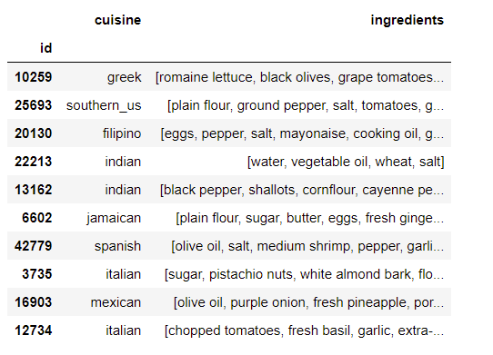
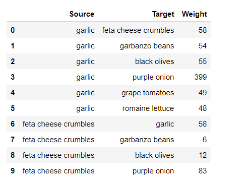
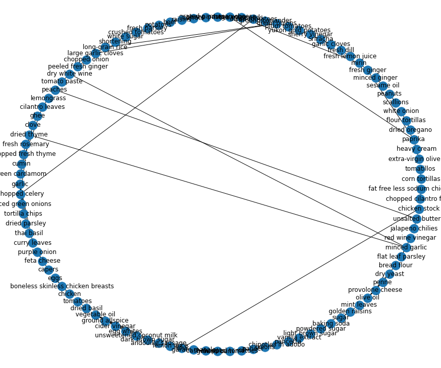

# Recommendation Engine

## Input Dataset
    Input dataset contains variety of ingredients for 20 different couisines
    such as 'greek', 'southern_us', 'filipino', 'indian', 'jamaican',
    'spanish', 'italian', 'mexican', 'chinese', 'british', 'thai',
    'vietnamese', 'cajun_creole', 'brazilian', 'french', 'japanese',
    'irish', 'korean', 'moroccan', 'russian'. 

## Input for Network Graph
    Input for network graph was created where there is a source ingredient,
    corresponding target ingredient and their corresponding weight based on
    their presence on ingredients.

## Graph Network for source and target with weight equal to 60 only.

